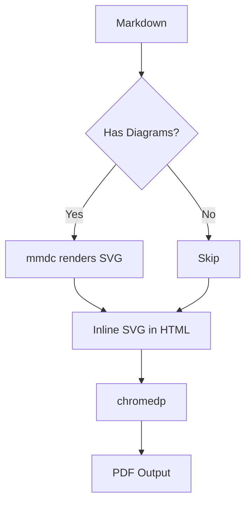
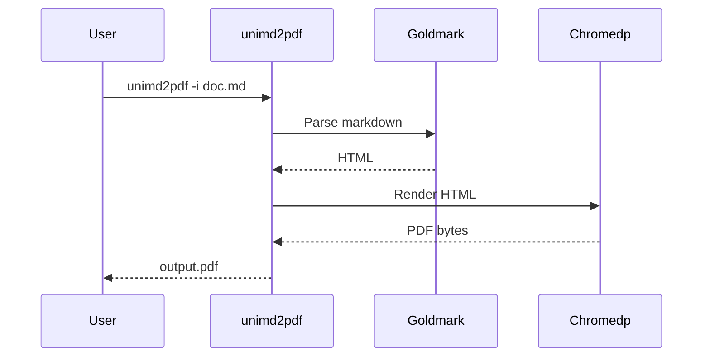
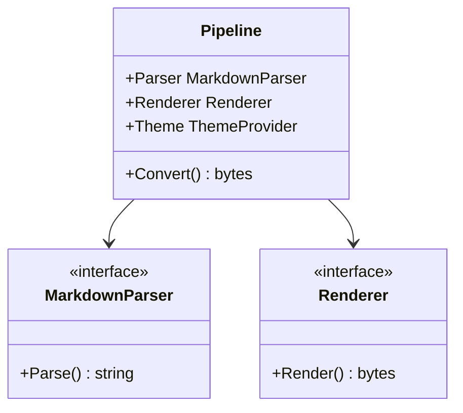
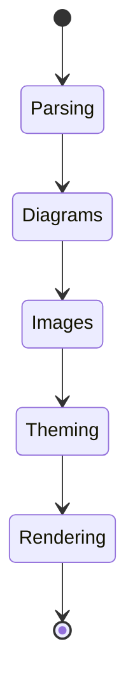

# Mermaid Diagrams

> Requires `mmdc`. Install: `npm install -g @mermaid-js/mermaid-cli`

## Flowchart

```mermaid
flowchart TD
    A[Markdown] --> B{Has Diagrams?}
    B -->|Yes| C[mmdc renders SVG]
    B -->|No| D[Skip]
    C --> E[Inline SVG in HTML]
    D --> E
    E --> F[chromedp]
    F --> G[PDF Output]
```

## Sequence Diagram

```mermaid
sequenceDiagram
    participant U as User
    participant CLI as unimd2pdf
    participant GM as Goldmark
    participant CD as Chromedp

    U->>CLI: unimd2pdf -i doc.md
    CLI->>GM: Parse markdown
    GM-->>CLI: HTML
    CLI->>CD: Render HTML
    CD-->>CLI: PDF bytes
    CLI-->>U: output.pdf
```

## Class Diagram

```mermaid
classDiagram
    class Pipeline {
        +Parser MarkdownParser
        +Renderer Renderer
        +Theme ThemeProvider
        +Convert() bytes
    }
    class MarkdownParser {
        <<interface>>
        +Parse() string
    }
    class Renderer {
        <<interface>>
        +Render() bytes
    }
    Pipeline --> MarkdownParser
    Pipeline --> Renderer
```

## State Diagram

```mermaid
stateDiagram-v2
    [*] --> Parsing
    Parsing --> Diagrams
    Diagrams --> Images
    Images --> Theming
    Theming --> Rendering
    Rendering --> [*]
```
