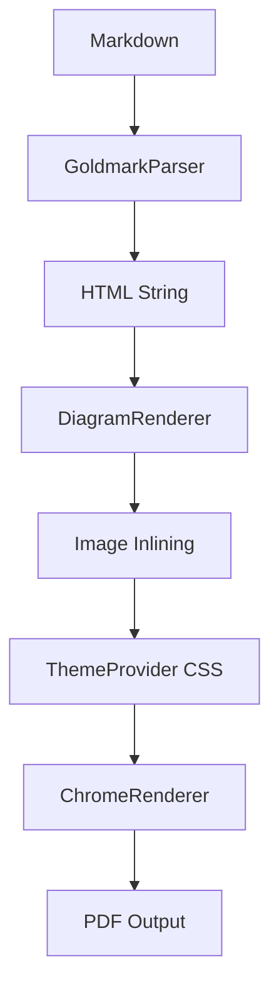

# Project: unimd2pdf

## Summary

A universal Markdown to PDF converter built with Go. Uses goldmark for parsing, chromedp for rendering, and mmdc for Mermaid diagrams.

## Architecture



## Features

| Feature | Implementation | Status |
|---------|---------------|--------|
| GFM | goldmark extension.GFM | Done |
| Syntax Highlighting | goldmark-highlighting | Done |
| Mermaid Diagrams | mmdc CLI | Done |
| Footnotes[^1] | goldmark extension.Footnote | Done |
| Definition Lists | goldmark extension.DefinitionList | Done |
| Dark Theme | convert/theme | Done |
| Custom CSS | `--theme path.css` | Done |

## Tech Stack

Go
:   Primary language. Compiles to single binary.

Goldmark
:   Markdown parser with GFM support.

Chromedp
:   Headless Chrome automation for PDF rendering.

mmdc
:   Mermaid CLI for diagram SVG generation.

## Configuration

```yaml
theme: light
page:
  size: A4
  margin: "20mm 18mm"
code:
  highlight-style: github
mermaid:
  enabled: true
  theme: default
```

## CLI Usage

```bash
# Basic
unimd2pdf -i doc.md

# With options
unimd2pdf -i doc.md --theme dark --page-size Letter

# Custom font
unimd2pdf -i doc.md --font "Noto Sans KR" --font-size 12pt
```

## Timeline

| Phase | Duration | Deliverable |
|-------|----------|-------------|
| MVP | 2 weeks | Basic conversion pipeline |
| Extensions | 1 week | Footnotes, definition lists, CJK |
| Polish | 1 week | Brew tap, CI/CD, documentation |

---

[^1]: Footnotes appear at the bottom of the page with backlinks.
